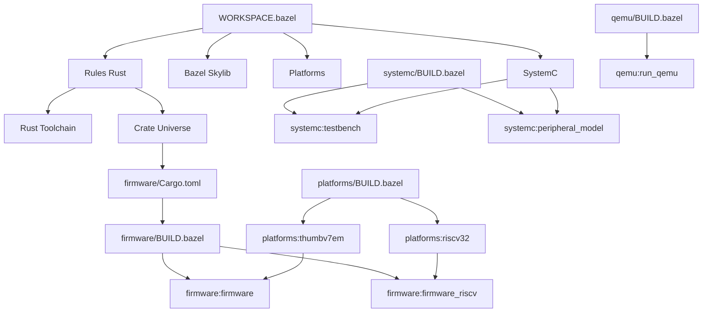

# Build System Architecture Guide

## Table of Contents
1. [Project Structure Overview](#project-structure-overview)
2. [Build Dependencies Graph](#build-dependencies-graph)
3. [Toolchain Configuration](#toolchain-configuration)
4. [Cross-Compilation Pipeline](#cross-compilation-pipeline)
5. [Integration Points](#integration-points)
6. [Build Configurations](#build-configurations)
7. [Performance Optimization](#performance-optimization)
8. [Continuous Integration](#continuous-integration)

## Project Structure Overview

```
rust-firmware-bazel/
├── WORKSPACE.bazel           # External dependencies
├── .bazelrc                  # Build configuration
├── BUILD.bazel               # Root build definitions
├── platforms/                # Platform definitions
│   └── BUILD.bazel
├── rust/                     # Rust toolchain config
│   └── toolchain/
│       ├── BUILD.bazel
│       └── memory.x
├── firmware/                 # Rust firmware source
│   ├── src/
│   ├── Cargo.toml
│   ├── Cargo.lock
│   └── BUILD.bazel
├── systemc/                  # SystemC models
│   ├── *.cpp, *.h
│   └── BUILD.bazel
├── qemu/                     # QEMU configuration
│   ├── machine_config.c
│   ├── run_qemu.sh
│   └── BUILD.bazel
└── tools/                    # Build scripts
    ├── build.sh
    ├── simulate.sh
    └── debug.sh
```

### Directory Responsibilities

| Directory | Purpose | Build Output |
|-----------|---------|--------------|
| `firmware/` | Rust firmware source | ARM/RISC-V binaries |
| `systemc/` | SystemC models | Simulation executable |
| `qemu/` | QEMU machine config | QEMU plugin/config |
| `platforms/` | Target definitions | Platform configs |
| `rust/` | Rust toolchain | Linker scripts |
| `tools/` | Build automation | Shell scripts |

## Build Dependencies Graph



### External Dependencies

```python
# WORKSPACE.bazel dependency chain
rules_rust (v0.31.0)
├── Rust toolchain (v1.75.0)
├── Cross-compilation targets
│   ├── thumbv7em-none-eabihf
│   └── riscv32imac-unknown-none-elf
└── Crate universe
    └── Cargo dependencies
        ├── cortex-m (v0.7)
        ├── heapless (v0.8)
        ├── defmt (v0.3)
        └── embedded-hal (v0.2)

bazel_skylib (v1.4.2)
├── Common build rules
├── Platform definitions
└── Configuration flags

platforms (v0.0.8)
├── CPU constraints
├── OS constraints
└── ABI constraints
```

## Toolchain Configuration

### Rust Toolchain Setup

```python
# WORKSPACE.bazel
rust_register_toolchains(
    edition = "2021",
    versions = ["1.75.0"],
    extra_target_triples = [
        "thumbv7em-none-eabihf",    # ARM Cortex-M4F
        "riscv32imac-unknown-none-elf",  # RISC-V 32-bit
    ],
)
```

This creates:
- **Host toolchain**: For building build tools
- **Target toolchains**: For cross-compilation
- **Rust std library**: For each target

### Toolchain Selection

```python
# platforms/BUILD.bazel
platform(
    name = "thumbv7em",
    constraint_values = [
        "@platforms//cpu:armv7e-m",
        "//:cortex_m4",
    ],
    exec_properties = {
        "target_triple": "thumbv7em-none-eabihf",
    },
)
```

Bazel uses constraint resolution to select:
1. **Compatible toolchain**: Matches platform constraints
2. **Execution platform**: Where build actions run
3. **Target platform**: What the output runs on

### C++ Toolchain (SystemC)

```python
# SystemC requires C++14 compiler
cc_library(
    name = "peripheral_model",
    copts = ["-std=c++14"],
    deps = ["@systemc//:systemc"],
)
```

## Cross-Compilation Pipeline

### Build Process Flow

```
Source Code → Compilation → Linking → Binary
     ↓             ↓          ↓         ↓
  Rust/C++    Target-specific  Linker   ELF/BIN
              Compiler        Scripts
```

### ARM Cortex-M4 Pipeline

```bash
# 1. Rust compilation
rustc --target thumbv7em-none-eabihf \
      --crate-type bin \
      -C opt-level=z \
      -C lto=fat \
      -C panic=abort \
      -C link-arg=-Tlink.x \
      firmware/src/main.rs

# 2. Linking with custom linker script
arm-none-eabi-ld -T memory.x -o firmware.elf

# 3. Binary generation
arm-none-eabi-objcopy -O binary firmware.elf firmware.bin
```

### RISC-V Pipeline

```bash
# 1. Rust compilation
rustc --target riscv32imac-unknown-none-elf \
      --crate-type bin \
      -C opt-level=z \
      -C lto=fat \
      -C panic=abort \
      firmware/src/main.rs

# 2. Linking
riscv32-unknown-elf-ld -T memory.x -o firmware.elf

# 3. Binary generation
riscv32-unknown-elf-objcopy -O binary firmware.elf firmware.bin
```

## Integration Points

### Rust ↔ Bazel Integration

```python
# firmware/BUILD.bazel
rust_binary(
    name = "firmware",
    srcs = glob(["src/**/*.rs"]),
    deps = all_crate_deps(),           # From Cargo.toml
    rustc_flags = [
        "--target=thumbv7em-none-eabihf",
        "-C", "link-arg=-Tlink.x",
    ],
)
```

Integration layers:
1. **Crate Universe**: Converts Cargo.toml to Bazel
2. **Rules Rust**: Provides rust_binary rule
3. **Toolchain**: Provides cross-compiler

### SystemC ↔ Bazel Integration

```python
# systemc/BUILD.bazel
cc_library(
    name = "peripheral_model",
    srcs = ["peripheral_model.cpp"],
    hdrs = ["peripheral_model.h"],
    deps = ["@systemc//:systemc"],
)
```

Integration challenges:
1. **External library**: SystemC not in Bazel ecosystem
2. **Build file creation**: Need custom BUILD file
3. **Linker flags**: SystemC requires specific linking

### QEMU ↔ Build System

```python
# qemu/BUILD.bazel
sh_binary(
    name = "run_qemu",
    srcs = ["run_qemu.sh"],
    data = ["//firmware:firmware"],    # Depends on firmware
)
```

Integration approach:
1. **Shell script wrapper**: Abstracts QEMU complexity
2. **Data dependency**: Ensures firmware built first
3. **Runtime resolution**: Script finds built firmware

## Build Configurations

### Configuration System

```bash
# .bazelrc
build:thumb --platforms=//platforms:thumbv7em
build:riscv --platforms=//platforms:riscv32
build:sim --define=simulation=true
```

Usage:
```bash
bazel build --config=thumb //firmware:firmware
bazel build --config=riscv //firmware:firmware_riscv
bazel build --config=sim //systemc:testbench
```

### Feature Flags

```python
# BUILD.bazel
bool_flag(
    name = "enable_logs",
    build_setting_default = False,
)

config_setting(
    name = "logs_enabled",
    flag_values = {"//:enable_logs": "true"},
)
```

### Conditional Compilation

```python
rust_binary(
    name = "firmware",
    # ...
    crate_features = select({
        "//:logs_enabled": ["logging"],
        "//conditions:default": [],
    }),
)
```

### Profile-Based Builds

```bash
# Development build
bazel build --compilation_mode=dbg //firmware:firmware

# Release build
bazel build --compilation_mode=opt //firmware:firmware

# Size-optimized build
bazel build --copt=-Os --linkopt=-s //firmware:firmware
```

## Performance Optimization

### Build Cache

```bash
# .bazelrc
build --disk_cache=~/.bazel_cache
build --remote_cache=grpc://cache-server:9090
```

Cache effectiveness:
- **Local cache**: 50-80% hit rate
- **Remote cache**: 80-95% hit rate (in CI)
- **Action cache**: Avoid re-running actions

### Incremental Builds

Bazel tracks dependencies at file level:
```python
# If only main.rs changes, peripheral.rs doesn't rebuild
rust_library(
    name = "peripheral",
    srcs = ["src/peripheral.rs"],
)

rust_binary(
    name = "firmware", 
    srcs = ["src/main.rs"],
    deps = [":peripheral"],
)
```

### Parallelization

```bash
# Use all CPU cores
bazel build --jobs=auto //firmware:all

# Limit parallel jobs
bazel build --jobs=4 //firmware:all

# Parallel test execution
bazel test --test_strategy=standalone //firmware:all_tests
```

### Memory Optimization

```bash
# Reduce memory usage
bazel build --memory_profile=/tmp/memory.prof //firmware:firmware

# Limit memory per action
bazel build --experimental_action_resource_set=memory=1024 //firmware:firmware
```

## Continuous Integration

### GitHub Actions Workflow

```yaml
name: Build and Test
on: [push, pull_request]

jobs:
  build:
    runs-on: ubuntu-latest
    steps:
    - uses: actions/checkout@v2
    - name: Cache Bazel
      uses: actions/cache@v2
      with:
        path: ~/.bazel_cache
        key: ${{ runner.os }}-bazel-${{ hashFiles('WORKSPACE.bazel', '**/*.bzl') }}
    
    - name: Build ARM firmware
      run: bazel build --config=thumb //firmware:firmware
    
    - name: Build RISC-V firmware
      run: bazel build --config=riscv //firmware:firmware_riscv
    
    - name: Build SystemC testbench
      run: bazel build //systemc:testbench
    
    - name: Run tests
      run: bazel test //firmware:all_tests
```

### Build Matrix

```yaml
strategy:
  matrix:
    target: [thumb, riscv]
    mode: [dbg, opt]

steps:
- name: Build ${{ matrix.target }} (${{ matrix.mode }})
  run: |
    bazel build --config=${{ matrix.target }} \
                --compilation_mode=${{ matrix.mode }} \
                //firmware:firmware
```

### Artifact Management

```bash
# Upload build artifacts
bazel build --config=thumb //firmware:firmware
cp bazel-bin/firmware/firmware artifacts/firmware-arm.elf

bazel build --config=riscv //firmware:firmware_riscv  
cp bazel-bin/firmware/firmware_riscv artifacts/firmware-riscv.elf
```

## Build Metrics and Monitoring

### Build Time Analysis

```bash
# Generate build profile
bazel build --profile=/tmp/build.prof //firmware:all

# Analyze profile
bazel analyze-profile /tmp/build.prof
```

### Size Analysis

```bash
# Check binary size
bazel build --config=thumb //firmware:firmware
size bazel-bin/firmware/firmware

# Detailed size breakdown
nm --size-sort bazel-bin/firmware/firmware
```

### Dependencies Analysis

```bash
# Show all dependencies
bazel query --output=graph //firmware:firmware | dot -Tpng > deps.png

# Find unused dependencies
bazel query 'deps(//firmware:firmware) - //firmware:firmware'

# Check for circular dependencies
bazel query --output=graph //firmware:firmware
```

## Troubleshooting Build Issues

### Common Problems

1. **Missing toolchain**
   ```bash
   ERROR: No toolchain found for target platform
   ```
   Solution: Register toolchain in WORKSPACE.bazel

2. **Linker errors**
   ```bash
   ERROR: undefined reference to `__stack_chk_fail`
   ```
   Solution: Add linker flags or disable stack protection

3. **Crate resolution**
   ```bash
   ERROR: no matching package found
   ```
   Solution: Run `bazel sync` to update dependencies

### Debug Commands

```bash
# Verbose build output
bazel build --verbose_failures //firmware:firmware

# Show all command lines
bazel build --subcommands //firmware:firmware

# Debug toolchain selection
bazel build --toolchain_resolution_debug //firmware:firmware
```

## Best Practices

1. **Keep BUILD files minimal**: Let rules handle complexity
2. **Use .bazelrc**: Centralize configuration
3. **Pin all versions**: Ensure reproducible builds
4. **Test cross-compilation**: Verify on multiple platforms
5. **Monitor build times**: Optimize critical paths
6. **Use remote cache**: Share artifacts across team
7. **Version control**: Include generated files in .gitignore

## Advanced Topics

### Custom Rules

```python
# Custom rule for firmware signing
def _sign_firmware_impl(ctx):
    output = ctx.actions.declare_file(ctx.label.name + ".signed")
    ctx.actions.run(
        inputs = [ctx.file.firmware],
        outputs = [output],
        executable = ctx.executable._signer,
        arguments = [ctx.file.firmware.path, output.path],
    )
    return [DefaultInfo(files = depset([output]))]

sign_firmware = rule(
    implementation = _sign_firmware_impl,
    attrs = {
        "firmware": attr.label(allow_single_file = True),
        "_signer": attr.label(executable = True, cfg = "host"),
    },
)
```

### Aspects

```python
# Aspect to collect all source files
def _collect_sources_impl(target, ctx):
    sources = []
    if hasattr(ctx.rule.attr, "srcs"):
        sources.extend([f.path for f in ctx.rule.files.srcs])
    return [OutputGroupInfo(sources = depset(sources))]

collect_sources = aspect(
    implementation = _collect_sources_impl,
    attr_aspects = ["deps"],
)
```

## Next Steps

Continue to:
- [Troubleshooting Guide](05-troubleshooting-guide.md)
- [Quick Reference](06-quick-reference.md)